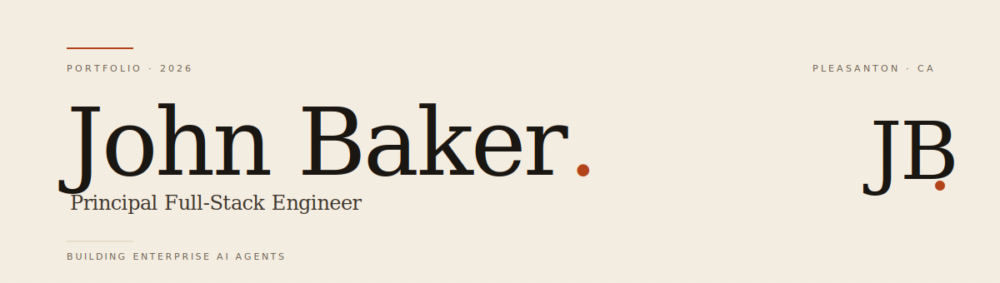

  

  <a href="https://juubaker.github.io"><strong>Portfolio</strong></a> ·
  <a href="https://linkedin.com/in/johnwilliambaker">LinkedIn</a> ·
  <a href="mailto:johnbakerjobs@gmail.com">Email</a> ·
  <a href="tel:+15106485818">510 · 648 · 5818</a>

 

### Hello.

Twenty-five years of shipping enterprise software — most recently at **Oracle** (HCM Cloud), before that on the **NetBeans IDE** team at Sun Microsystems, and earlier on control systems for the National Ignition Facility at **Lawrence Livermore National Lab**.

These days I build the unglamorous middle of AI agent systems: the agent loop, the policy engine, and the audit log that all have to behave in production.

**Currently:** Open to Senior or Principal Engineer roles on AI-forward teams at enterprise SaaS companies in the SF Bay Area / East Bay.

 

### Selected work

<table>
<tr>
<td width="50%" valign="top">

#### [NexusAgent](https://github.com/juubaker/HCM_workflow_agent)

Open-source Enterprise AI Integration Command Center. Orchestrates LLM tool-use across HCM, CRM, and ticketing systems with real-time SSE streaming. Centralized policy engine, append-only JSONL audit log, behavioral eval harness.

`TypeScript` · `Node.js` · `React` · `Ollama`

</td>
<td width="50%" valign="top">

#### HCM Benefits Triage Agent

Three-pane benefits support triage built on a 10-category Oracle HCM taxonomy. Express + PostgreSQL backend, React frontend, 85-test Vitest suite.

`React` · `Express` · `PostgreSQL` · `Drizzle` · `Anthropic API`

</td>
</tr>
<tr>
<td width="50%" valign="top">

#### Benefits Enrollment Agent

Six-tool Claude agent with a recursive enrollment loop. Built in the Oracle Redwood design aesthetic, backed by a 75-test Vitest suite.

`React` · `Vite` · `Anthropic API` · `Tool-use`

</td>
<td width="50%" valign="top">

#### PrepAI

Interview coaching tool with four question categories and AI-powered scoring. Dark, focused interface designed to lower the anxiety of practice.

`React` · `Vite` · `Anthropic API`

</td>
</tr>
</table>

→ Full case studies on <a href="https://juubaker.github.io"><strong>juubaker.github.io</strong></a>

 

### Background

**Oracle Corporation** &nbsp;·&nbsp; Principal Applications Developer, HCM Cloud (Pleasanton) &nbsp;·&nbsp; through early 2026
**Sun Microsystems** &nbsp;·&nbsp; Senior Software Engineer, NetBeans IDE team &nbsp;·&nbsp; ~12 years
**Lawrence Livermore National Lab** &nbsp;·&nbsp; GUI &amp; J2EE, National Ignition Facility control systems
**Informix, IntelliCorp** &nbsp;·&nbsp; earlier engineering roles

B.S. Computer Science &nbsp;·&nbsp; California State University, Chico

 

### Selected shipped work, pre-AI era

- Shipped the **SQL History** feature in NetBeans 6.5
- Spring Web Framework UI contributions in NetBeans
- Three years as a **JavaOne Hands-On Labs** instructor
- Production J2EE for laser control at the National Ignition Facility
